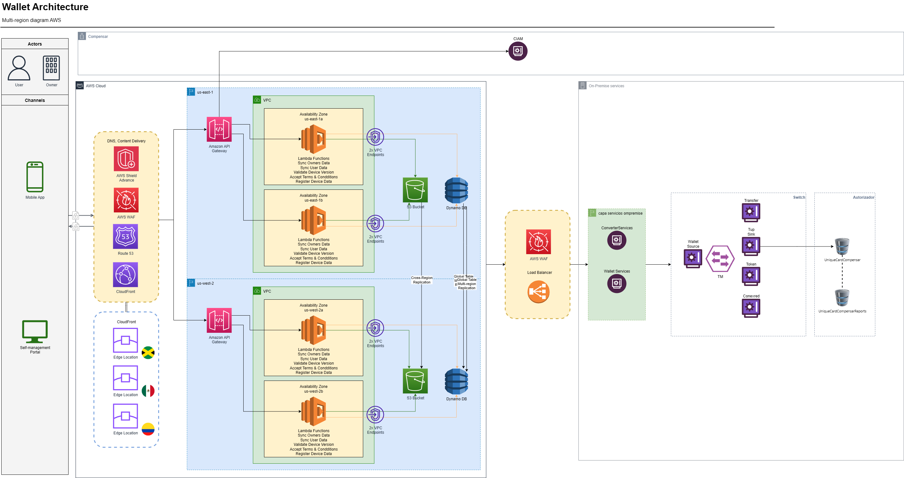

# Billetera Compensar

La **Billetera Compensar** es una aplicación móvil desarrollada para la caja de compensación familiar **Compensar**, que permite a los usuarios realizar diferentes transacciones financieras de forma segura y rápida.

## Funcionalidades principales

- **Recargas**: Realiza recargas a líneas celulares.
- **Pago de facturas**: Paga servicios públicos y privados.
- **Transferencias**: Envío y recepción de dinero entre usuarios.
- **Banners promocionales**: Información y promociones actualizadas.
- **Pagos con QR**: Escaneo y pago mediante códigos QR.
- **Generación de token**: Seguridad adicional en transacciones.

## Arquitectura y flujo

> _Este diagrama representa el flujo de comunicación de la billetera con otros servicios._

